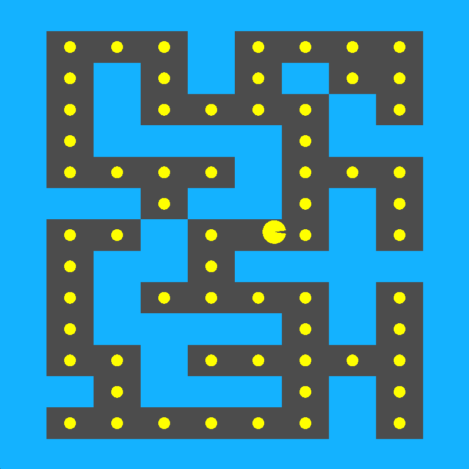
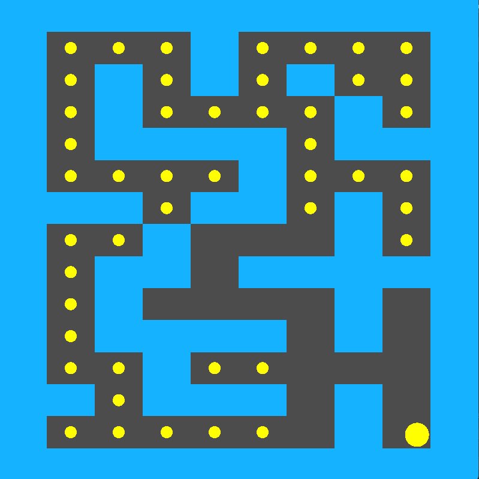

# 🎮 Pieman Game (OpenGL + GLUT)

A simple 2D arcade-style game inspired by *Pac-Man*, created in C++ using **OpenGL** and **GLUT**.  
The game features a player-controlled "Pieman" who moves around a maze eating pellets. The movement keys are the arrow keys.

---

## 🧠 Features
- Implemented entirely in **one file** (`main.cpp`) for simplicity.
- Uses **colors** to represent walls, pellets, and the Pieman (no textures required).
- Real-time keyboard input for movement.
- Basic collision detection with walls.
- Smooth rendering and animation using GLUT display callbacks.
- 
---
## 📱 App Screens

<p align="center">
  
  
</p>

<p align="center">
  
  
</p>
---

## 🛠️ Tech Stack
- **Language:** C++
- **Graphics Library:** OpenGL (GL, GLU)
- **Windowing Toolkit:** GLUT

---

## ▶️ How to Run

### On Linux / macOS
```bash
sudo apt-get install freeglut3-dev    # if not installed
g++ main.cpp -lGL -lGLU -lglut -o pieman
./pieman

## if the above doesnot work try
clang++ -lGL -lglut -lGLU main.cpp -o Pieman
./pieman
